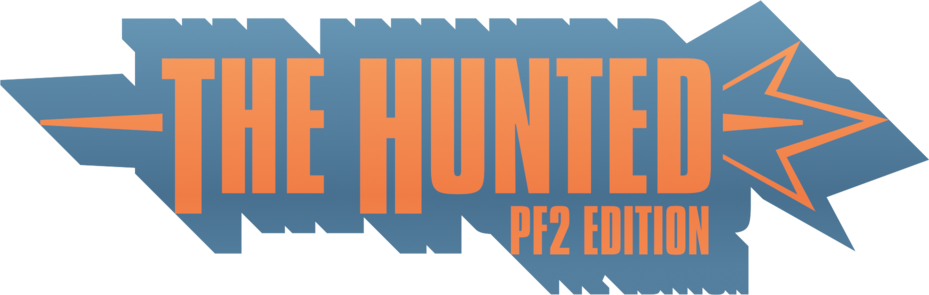

# The Hunted (PF2 Edition)

	

A revival of the original Hunted plugin from TF2, revised and updated for PF2! The premise is simple: BLU guides the Civilian to an escape zone, while RED tries to stop him from escaping. When the Civilian is killed, instead of starting a whole new round, the players are all respawned. BLU wins if they manage to get the Civilian to the escape zone within the allotted time, while RED wins if they successfully prevent him from capturing the escape zone long enough for the timer to hit zero. It's pretty fast-paced, leading to lots of high-octane action no matter what team or role you're in!

## Official Maps (WIP)

These maps are currently work-in-progress as they are assessed alongside the gamemode itself.

- **Hunted II** - A revival of Valve's alpine-themed Hunted remake, adapted for this very gamemode! BLU must protect the Civilian as he makes his way through a logging camp, while RED must stop him before he reaches the inconspicuous mining elevator. A fairly straightforward take on the original Hunted, but with some much-needed modern niceties. - <a href="https://drive.google.com/drive/folders/1g_cAazPa-CxsgWzu2unf5TVeeiF_2J41?usp=drive_link">Google Drive Link</a>
- **Downtown** - A remake of the map Downtown, released by David Norton for Team Fortress Classic in 1999. The Civilian must sneak through various buildings and back-alleys to his escape helicopter at the end! It's relatively short, but with multiple routes and different connectors, you'll rarely take the same path each round. - <a href="https://drive.google.com/drive/folders/1KC0ryunJ3tr75facDUSixlhqUv0pFg7D?usp=drive_link">Google Drive Link</a>
- **Hydro** - A familiar facility, but with a twist! An truck is ready to take the Civilian to a safe location, but RED has caught wind of the extraction. With no other option, BLU must guide the Civilian from their underground base to Alpha Electric before RED can lay a hand on him. There's three main routes BLU can push through, leading to a wide final area and a tense escape zone. Don't worry, Hydro fans; we only blocked off 75% of the map! - <a href="https://drive.google.com/drive/folders/1AxypEZOQ9ZIkN6biNca0ZLF8l7VptKXU?usp=drive_link">Google Drive Link</a>

There's some other maps too, but I'm waiting to get the authors' permissions to put 'em here.

## Mapping Info

Under the hood, maps are just Attack/Defend maps with a singular point. The plugin handles most of the logic, which means all the mapper has to do is make an A/D map. However, there are many important details to take into account:

- BLU is the bodyguards + the Civilian, RED is the assassins. The exact class selection can differ depending on the map and server settings, but BLU guarding the Civilian and RED being the hunters remains a constant.
- Non-Civilian players cannot interact with any ``trigger_capture_area`` entities. The plugin forces these triggers to only be tangible to the Civilian. This prevents BLU from contributing to capture progress and prevents RED from interrupting captures.
- Flag entities are used under the hood for the Civilian outline, and as a result, using flags in this mode can result in unexpected issues. Be warned!
- At this time, the plugin expects maps to be prefixed with "esc_" to function. See the TO-DO below to see future plans regarding this...

### Mapping Guidelines

There aren't many defined 'rules' at the moment, but as of writing, here are my basic guidelines I have followed:

- In the current map selection, the final point is not visually a 'control point', it is usually some sort of uniquely designed escape method, unified by the blue minecart symbol. The idea is to eventually create a better unifying symbol for this, but since the plugin is still in its early days, nothing has been set in stone yet.

### Warning Zones

Both teams are notified when the Civilian is nearing the escape zone. This is handled by a ``trigger_multiple`` entity with a targetname of ``escape_warn``. The size of this trigger should cover a reasonable area, like the open helipad area of TFC's Hunted, to give attackers a decent chance of acting on it.

## TO-DO

- Give the Civilian a faster default respawn time, separate from the other players. With vanilla respawn times, the Civilian takes 37 years (around 10-12 seconds) to respawn. The respawn time should be quick enough to allow quick transitions into the next mini-round. More extensive testing with respawn times needs to be done in general, as pretty much all of the playtesting in this mode was done with respawn times disabled.
- Add a way to let map makers define a custom class roster for their map. This would be overridden by the server's custom roster setting if it was not set to default. Ideally, the mapper would be able to specify completely custom rosters instead of choosing from one of the presets. It might be better to wait for PF2 to get Live's class limit commands before doing something like this, as that would render anything done plugin-side pointless.
- Whenever the Civilian dies or respawns, the vanilla TF2 flag notifications pop up on the screen. It is possible to remove them by intercepting the user message, though! I just haven't done it yet.
- To prevent any conflicts with future PF2 plans for Civilian-related shenanigans, the plugin should instead detect maps designed for the gamemode by parsing through all ``info_target`` entities around the map and checking for a specific targetname. This isn't a huge priority at the moment due to the lack of an official escort mode, but redoing it to be like this would be the best practice going forward.
- The custom voting system has been removed from the public release, due to bugs with votes being doubled up on *any* in-game vote, not just Civvy votes. I'll be taking a look at NativeVotes and trying to integrate it in the future.

## Bugs

- If spawns designated for the Civilian are blocked by a teammate, the Civilian will often be forced into a different BLU spawn. No idea how to rectify this at the moment, but in the worst case scenario, the spawnpoints could be parsed through for the plugin to manually place everyone. That's gross, though.
- Very rarely, the teams may not respawn when the Civilian dies. This may be related to the behavior of the original plugin, where the players and map do not get reset if the Civilian killbinds or dies from an unassisted environmental death. This was put in place to prevent abuse on maps like Dustbowl, but since this version of the plugin is geared towards fast-paced rounds without setup time, it might be more trouble to keep it around. Still pondering the next step to rectify this...
- Not so much a bug as it is a limitation, but the Civilian will not be outlined if he is ubered. Not a high priority fix at the moment, but it does bug me, so I guess it *is* a bug.